# LMSm 문서

### 비밀번호 초기화
---

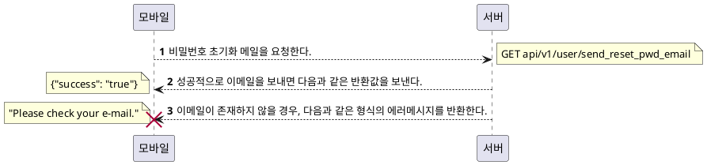

### 로그인

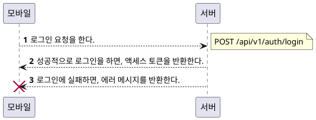

### 회사 목록

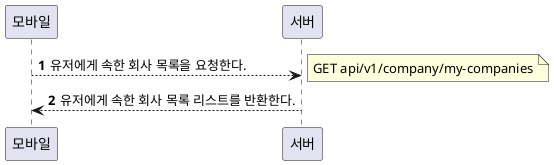

### 회사 선택

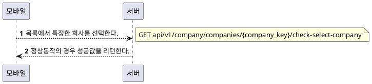

### 노티스 목록

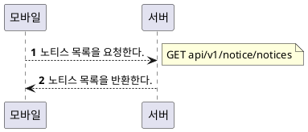

### 알림(NOTICE) 아이템

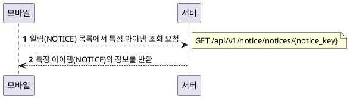

### 투두 리스트(TODO LIST)

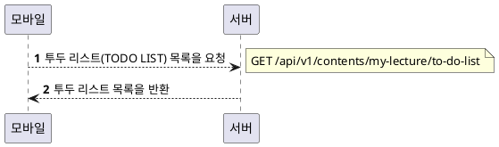

### 옵셔널 렉처 리스트 (OPTIONAL LIST)

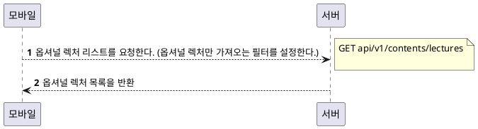

### 모든 렉처 리스트 (ALL LECTURE LIST)

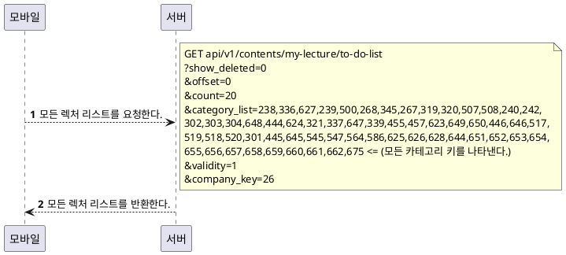

### 코스 디테일

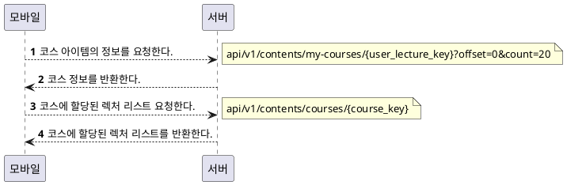

### 렉처 디테일

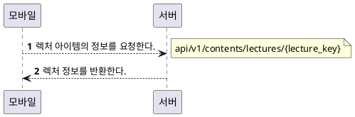

### 렉처 콘텐츠

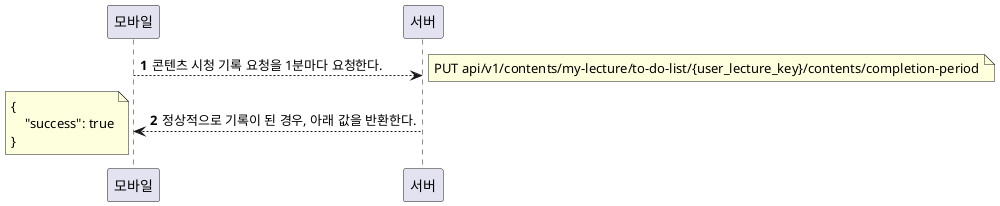
### 렉처 수강 완료
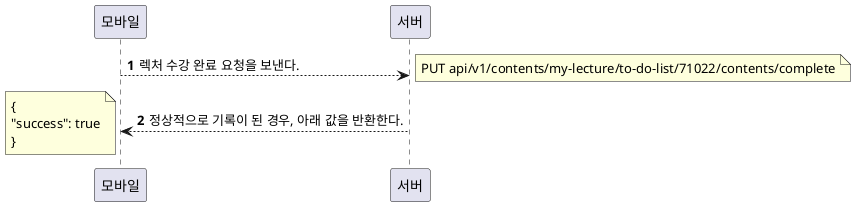

### 퀴즈와 관련된 정보를 불러 온다.

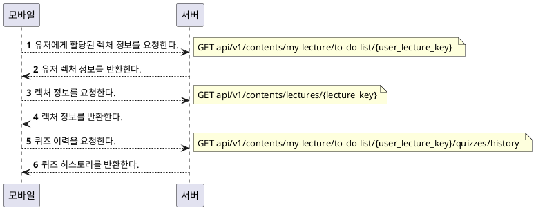

### 퀴즈 시작 버튼을 눌렀을 때

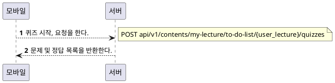

### 다음 버튼을 눌렀을 때

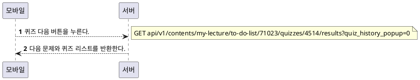

### 퀴즈가 자동으로 채점 될 때

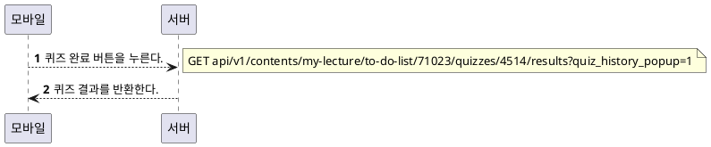
